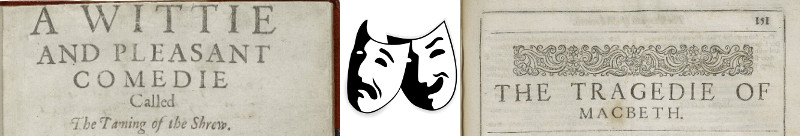
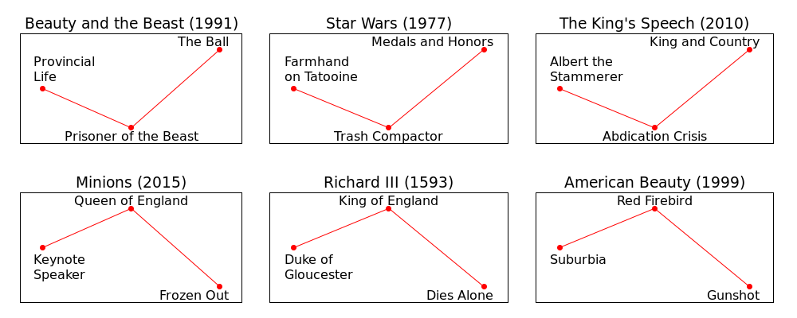
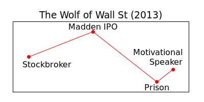

# Comedy and Tragedy

All narratives fall into one of two categories: Comedy and Tragedy.
In modern filmmaking, "comedy" means "funny and easy to sell" and "tragedy" means "marketing suicide."
This association of tragedy in title with tragedy at the box office is recent.
Shakespeare, for instance, was clear in labeling his plays.
Both comedy and tragedy can contain humor, but their structures are as different as the masks of Thalia and Melpomene.

 <!-- make 800px wide -->

## Structure

Comedic heroes start out isolated, on the margins of their communities.
Their adventures take them to places of utter despair, but they pick up allies as they go.
They take increasing responsibility for others in their community, unite it and win the community's fight.
Comedy resolves with heroes taking their rightful places in the community, surrounded by friends.

* [Belle](https://movies.disney.com/beauty-and-the-beast) is stuck in a provincial life.
  Trying to save her father, she becomes a prisoner of The Beast and befriends the castle's inhabitants.
  Her love frees the prince from his curse, along with the prince's servants.
  Townsfolk, even those who shunned Belle, come to celebrate her achievement.
* [Luke Skywalker](https://www.lucasfilm.com/productions/episode-iv/) is stuck on a moisture farm.
  Helping the Rebellion deliver vital intelligence, he finds Aalderaan destroyed, himself and his party prisoners.
  Luke joins the fight, destroys the Death Star and saves the Galaxy.
  Luke returns to a hero's welcome with honors and decorations.
* [Prince Albert](https://www.imdb.com/title/tt1504320/) is stuck with a stammer, a weakling little brother to the heir apparent.
  His father's death and his brother's abdication thrust the royal family and the country into a crisis.
  Finding unlikely allies, Albert overcomes his limitations and becomes the king his country needs.
  When war comes to Britain, the entire country rallies around the popular king.
  

By way of contrast, tragic heroes start in a position of relative comfort, at their rightful station in life.
Tragic heroes shirk their responsibilities to their communities and rise in stature, but their success is illusory.
They alienate their supporters, losing friends as the story develops.
Tragedy resolves with the hero's expulsion from the community (banishment, imprisonment, death, self-exile).

* When we first meet [Scarlet Overkill](https://www.imdb.com/title/tt2293640/), she has been a top supervillain and getting away with it for some time.
  She achieves her dream of becoming Queen of England, but alienates the very minions who brought the crown to her.
  As her enemies grow more powerful, she loses other villains' support and must face her enemies alone.
  Her final defeat comes at the hands of a mere boy, a "younger, hungrier villain" Gru.
* When we first meet [Richard](http://www.gutenberg.org/cache/epub/1103/pg1103.txt), he is Duke of Gloucester, brother to the reigning king.
  Richard schemes to kill everyone ahead of him in the line of succession, including the nephews ("princes in the tower") he swore to protect.
  Richard becomes king, but his rule is shaky; as opposition to his violence grows, allies defect.
  Richard dies alone, with no one willing to answer his famous cry, "A horse! a horse! my kingdom for a horse!"
* [Lester Burnham](https://www.dreamworks.com/ab/) has an outwardly perfect life: suburban home, job, wife, daughter; but he feels that he's lost something.
  To get that something back, he blackmails his employer out of a year's worth of salary and proceeds to renege on every single obligation in his life.
  He trades the family sedan for a muscle car, smokes weed, chases teenage girls and takes a job with "the least possible amount of responsibility."
  When Lester dies, violently and inevitably, every person in his life has a motive to kill him.

## Taking Sides

It is tempting to describe comedy as the triumph of good and tragedy as the defeat of evil.
Our analysis holds story structure independent of audience sympathies.
The audience may root for Lester Burnham and justify his choices, but his trajectory is tragic: he rejects the dicta of his community, and the community rejects him violently.

While *American Beauty*'s morals are intentionally ambiguous, a large number of tragedies pit a sympathetic hero against a cruel, unjust society. *[Nineteen eighty-four](http://gutenberg.net.au/ebooks01/0100021.txt)* (1949) is a quintessential example.
Its structure follows the same tragic trajectory: Winston Smith rebels against his (dystopian) community, enjoys a period of freedom and sexual adventure, gets arrested and tortured, his friends Julia and O'Brian betray him.
Closing image finds him alone and ready to die.

## Hollywood Ending

Tragedies are popular with artists.
Comedies are popular with consumers.
A solution to this conundrum exists, if not a satisfying one: tack an artificial uplifting note onto the end of a tragedy.

The protagonist of *The Wolf of Wall Street* (2013) spends the entire film selling garbage to customers, cheating on wives, ratting out friends to the FBI and in general being a jerk to everyone.
There is no indication that his character will change.
But incredibly, the movie's final sequence has the protagonist surrounded by new customers waiting to gobble up new garbage.
As if this embezzler, junkie, ex-convict could teach an audience about lasting success in life.

When people complain about Hollywood Endings, they complain about this kind of non-sequitur conclusion.

## The Takeaway

* Comedy and Tragedy are two opposing trajectories characters can take through their story.
* These trajectories are direct consequences of protagonists' choices vis-a-vis their communities.
* Comedic and tragic trajectories are orthogonal to author and audience sympathies.
* Comedic and tragic trajectories are orthogonal to amount of humor in the narrative.
* You can tack a happy ending onto a tragedy, but it remains a tragedy.
